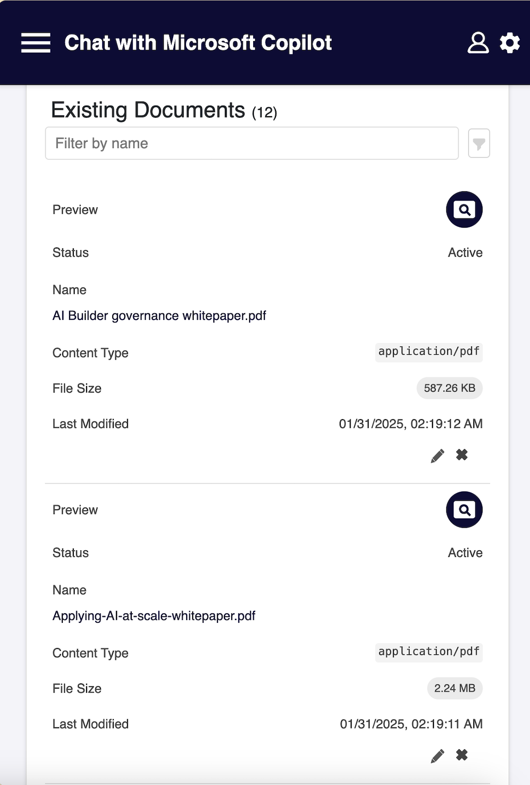
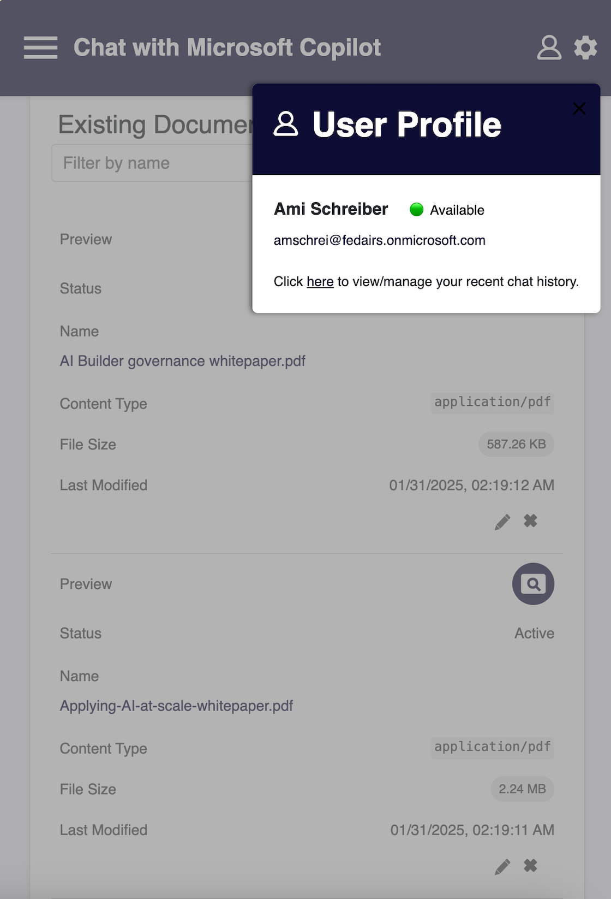
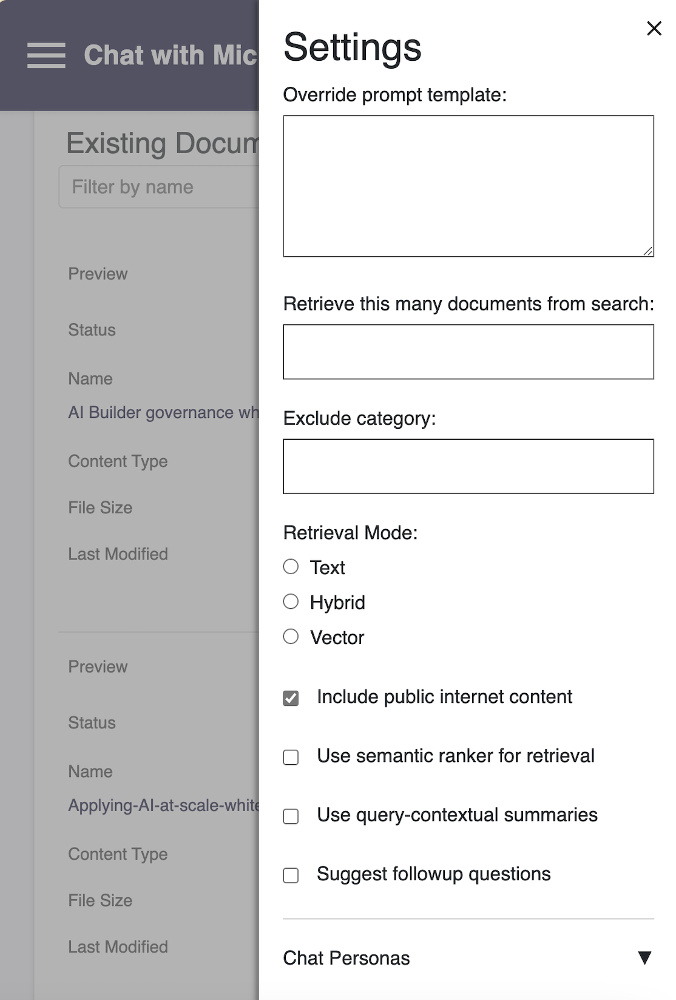

# Azure AI Demo

## Overview

This project is a web application that allows users to chat with Azure Copilot to query their own data. In addition to responses returned by Copilot, the application also provides the user with source references, suggested follow up questions AND a "Thought Process" tab which allows the user to understand how the AI arrived at it's answers. As an added bonus, a varity of AI personas are included which provide varying prompts based on their assigned descriptions. This allows the AI to focus on role specific aspects of the data being searched that would appear to be most important to a variety of different users. While searching the exact same dataset, the information which would be of interest to an IT professional would not be the same as what an attorney might be interested in. A list of all the included personas can be found [here](#chat-personas-list).

The solution is fully configurable via a parameters.json file. It includes a simple HTML interface and a PowerShell script for deployment.

## Web Application Screens

The index.html file includes the following screens:


## Prerequisites

### Core Tools (Required)

- [Node.js](https://nodejs.org/) (version 20 or higher recommended)
- [npm](https://www.npmjs.com/) (package management)
- [Azure CLI](https://docs.microsoft.com/en-us/cli/azure/install-azure-cli) (for deploying to Azure)
- [ms-vscode.azurecli](https://marketplace.visualstudio.com/items?itemName=ms-vscode.azurecli) - Azure CLI tools
- [ms-vscode.powershell](https://marketplace.visualstudio.com/items?itemName=ms-vscode.powershell) - PowerShell language support
- [PowerShell Core](https://github.com/PowerShell/PowerShell) (for running the deployment script)

### GitHub Integration (Required)

- [github.vscode-github-actions](https://marketplace.visualstudio.com/items?itemName=GitHub.vscode-github-actions) - GitHub Actions support

### Azure Development Tools (Optional)

- [azps-tools.azps-tools](https://marketplace.visualstudio.com/items?itemName=azps-tools.azps-tools) - Azure PowerShell tools
- [azurite.azurite](https://marketplace.visualstudio.com/items?itemName=Azurite.azurite) - Azure Storage emulator
- [ms-azure-devops.azure-pipelines](https://marketplace.visualstudio.com/items?itemName=ms-azure-devops.azure-pipelines) - Azure Pipelines support
- [ms-azuretools.azure-dev](https://marketplace.visualstudio.com/items?itemName=ms-azuretools.azure-dev) - Azure development tools
- [ms-azuretools.vscode-apimanagement](https://marketplace.visualstudio.com/items?itemName=ms-azuretools.vscode-apimanagement) - Azure API Management tools
- [ms-azuretools.vscode-azure-functions-web](https://marketplace.visualstudio.com/items?itemName=ms-azuretools.vscode-azure-functions-web) - Azure Functions tools
- [ms-azuretools.vscode-azureappservice](https://marketplace.visualstudio.com/items?itemName=ms-azuretools.vscode-azureappservice) - Azure App Service tools
- [ms-azuretools.vscode-azurefunctions](https://marketplace.visualstudio.com/items?itemName=ms-azuretools.vscode-azurefunctions) - Azure Functions tools
- [ms-azuretools.vscode-azureresourcegroups](https://marketplace.visualstudio.com/items?itemName=ms-azuretools.vscode-azureresourcegroups) - Azure Resource Groups tools
- [ms-azuretools.vscode-azurestaticwebapps](https://marketplace.visualstudio.com/items?itemName=ms-azuretools.vscode-azurestaticwebapps) - Azure Static Web Apps tools
- [ms-azuretools.vscode-azurestorage](https://marketplace.visualstudio.com/items?itemName=ms-azuretools.vscode-azurestorage) - Azure Storage tools
- [ms-azuretools.vscode-azurevirtualmachines](https://marketplace.visualstudio.com/items?itemName=ms-azuretools.vscode-azurevirtualmachines) - Azure Virtual Machines tools
- [ms-azuretools.vscode-bicep](https://marketplace.visualstudio.com/items?itemName=ms-azuretools.vscode-bicep) - Bicep language support

### GitHub Integration (Optional)

- [github.codespaces](https://marketplace.visualstudio.com/items?itemName=GitHub.codespaces) - GitHub Codespaces support
- [github.github-vscode-theme](https://marketplace.visualstudio.com/items?itemName=GitHub.github-vscode-theme) - GitHub theme for VS Code
- [github.remotehub](https://marketplace.visualstudio.com/items?itemName=GitHub.remotehub) - GitHub integration for remote repositories
- [github.vscode-pull-request-github](https://marketplace.visualstudio.com/items?itemName=GitHub.vscode-pull-request-github) - GitHub Pull Requests and Issues

### AI Tools (Optional)

- [ms-toolsai.vscode-ai](https://marketplace.visualstudio.com/items?itemName=ms-toolsai.vscode-ai) - AI tools for VS Code
- [ms-toolsai.vscode-ai-inference](https://marketplace.visualstudio.com/items?itemName=ms-toolsai.vscode-ai-inference) - AI Inference tools
- [ms-toolsai.vscode-ai-remote](https://marketplace.visualstudio.com/items?itemName=ms-toolsai.vscode-ai-remote) - AI Remote tools
- [ms-toolsai.vscode-ai-remote-web](https://marketplace.visualstudio.com/items?itemName=ms-toolsai.vscode-ai-remote-web) - AI Remote Web tools

### Remote Development (Optional)

- [ms-vscode-remote.remote-containers](https://marketplace.visualstudio.com/items?itemName=ms-vscode-remote.remote-containers) - Remote Containers support
- [ms-vscode-remote.remote-wsl](https://marketplace.visualstudio.com/items?itemName=ms-vscode-remote.remote-wsl) - Remote WSL support
- [ms-vscode.remote-explorer](https://marketplace.visualstudio.com/items?itemName=ms-vscode.remote-explorer) - Remote Explorer
- [ms-vscode.remote-repositories](https://marketplace.visualstudio.com/items?itemName=ms-vscode.remote-repositories) - Remote Repositories
- [ms-vscode.remote-server](https://marketplace.visualstudio.com/items?itemName=ms-vscode.remote-server) - Remote Server

### Miscellaneous Tools (Optional)

- [esbenp.prettier-vscode](https://marketplace.visualstudio.com/items?itemName=esbenp.prettier-vscode) - Code formatter
- [ms-vscode.azure-account](https://marketplace.visualstudio.com/items?itemName=ms-vscode.azure-account) - Azure Account management
- [ms-vscode.azure-repos](https://marketplace.visualstudio.com/items?itemName=ms-vscode.azure-repos) - Azure Repos support
- [ms-vscode.live-server](https://marketplace.visualstudio.com/items?itemName=ritwickdey.LiveServer) - Live Server for local development
- [ms-vscode.vscode-node-azure-pack](https://marketplace.visualstudio.com/items?itemName=ms-vscode.vscode-node-azure-pack) - Node.js Azure Pack
- [ms-vsliveshare.vsliveshare](https://marketplace.visualstudio.com/items?itemName=ms-vsliveshare.vsliveshare) - Live Share for collaboration
- [msazurermtools.azurerm-vscode-tools](https://marketplace.visualstudio.com/items?itemName=msazurermtools.azurerm-vscode-tools) - Azure Resource Manager tools
- [redhat.vscode-yaml](https://marketplace.visualstudio.com/items?itemName=redhat.vscode-yaml) - YAML language support

## Getting Started

### Installation

1. Clone the repository:

   ```
   git clone https://github.com/your-username/copilot-webapp-demo.git

   cd copilot-webapp-demo

   ```

2. Install [Node](https://nodejs.org/) and then install the required VS Code extensions ([extensions.txt](./src/deployment/extensions.txt)) using the following script (make sure you are in the `src/deployment directory`):

   ```
   function Install-Extensions {
    # Define the path to the text file
    $filePath = "extensions.txt"

    # Read all lines from the file
    $extensions = Get-Content -Path $filePath

    # Loop through each extension and install it using the `code` command
    foreach ($extension in $extensions) {
        code --install-extension $extension
    }
   }

   ```

### Deployment

The main PowerShell script [Azure AI Demo Deployment.ps1](./src/deployment/Azure%20AI%20Demo%20Deployment.ps1) automates the deployment of all the required Azure resources for this custom Copilot web application. There is a template titled [parameters.json](./src/deployment/parameters.json) which contains configuration settings for every aspect of the deployment. It includes initialization, helper functions, resource creation, update functions, and logging to ensure a smooth and automated deployment process.

Once the deployment script completes the following resources should have been created in the resource group:

- Api Management Service (optional)
- App Service
- App Service Plan
- Application Insights
- Azure AI Hub
- Azure AI Project
- Azure AI Services
- Azure AI Services Multi-Service Account
- Azure Machine Learning Registry
- Azure OpenAI
- Computer Vision
- Document Intelligence
- Function App
- Key Vault
- Log Analytics Workspace
- Managed Identity
- Search Service
- Smart Detector Alert Rule
- Storage Account
- Virtual Network

The image below shows a diagram of the deployed resources:


#### Script Workflow and Functions List

1. **Initialization and Setup:**

   - The script begins by setting the default parameters file (`parameters.json`).
   - Defines global variables for resource types and KeyVault secrets.
   - Sets the deployment path based on the current location.

2. **Parameter Initialization:**

   - The `Initialize-Parameters` function reads parameters from the specified JSON file.
   - Sets global variables for various Azure resources and configurations.
   - Retrieves the subscription ID, tenant ID, object ID, and user principal name using Azure CLI commands.

3. **Resource Creation Functions:**

   - The script defines multiple functions to create various Azure resources, such as:

     - `New-AIHub`: Creates AI Hub and AI Model.
     - `New-AIService`: Creates AI service.
     - `New-ApiManagementService`: - Creates new Api Management service.
     - `New-ApplicationInsights`: Creates new Application Insights service.
     - `New-AppService`: Creates and deploys app services (web apps or function apps).
     - `New-AppServiceEnvironment`: Creates new App Service Environment.
     - `New-AppServicePlanInASE`: Creates new App Service Plan in the ASE.
     - `New-CognitiveServicesAccount`: Creates new Cognitive Services account.
     - `New-ComputerVisionAccount`: Creates new Computer Vision account.
     - `New-ContainerRegistry`: Creates new Container Registry.
     - `New-DocumentIntelligenceAccount`: Creates new Document Intelligence account.
     - `New-KeyVault`: Creates a Key Vault and sets access policies.
     - `New-LogAnalyticsWorkspace`: Creates new Log Analytics Workspace.
     - `New-MachineLearningWorkspace`: Creates new Machine Learning Workspace. This will ultimately be deleted and replaced with a manual step detailed [below](#azure_ai_machine_learning_workspace).
     - `New-ManagedIdentity`: Creates a new managed identity.
     - `New-OpenAIAccount`: Creates a new OpenAI Account.
     - `New-PrivateEndPoint`: Creates a new private endpoint.
     - `New-ResourceGroup`: Creates a new resource group.
     - `New-Resources`: Creates multiple Azure resources like storage accounts, app service plans, search services, etc.
     - `New-SearchDataSource`, `New-SearchIndex`, `New-SearchIndexer`, `New-SearchService` and `New-SearchSkillSet`: Creates search-related resources.
     - `New-StorageAccount`: Creates a new Storage Account.
     - `New-SubNet`: Creates a new SubNet.
     - `New-VirtualNetwork`, `New-SubNet`: Create virtual network and subnets.

     - `New-ApiManagementService`: Creates and deploys API Management service.

4. **Helper Functions:**

   - The script includes several helper functions for various tasks, such as:
     - `ConvertTo-ProperCase`: Converts a string to proper case.
     - `Deploy-OpenAIModel`: Deploys an Azure AI model.
     - `Find-AppRoot`: Finds the app root directory.
     - `Format-ErrorInfo`, `Format-CustomErrorInfo`: Format error information.
     - `Get-CognitiveServicesApiKey`: Retrieves the API key for Cognitive Services.
     - `Get-DataSources`: Tests if a datasource exists.
     - `Get-LatestApiVersion`: Gets the latest API version for a resource type.
     - `Get-LatestDotNetRuntime`: Gets the latest .NET runtime version.
     - `Get-Parameters-Sorted`: Alphabetizes the parameters object.
     - `Get-RandomInt`: Generates a random integer.
     - `Get-SearchIndexes`, `Get-SearchIndexers`, `Get-SearchSkillSets`: Check if a search index, indexer, or skillset exists.
     - `Get-UniqueSuffix`: Finds a unique suffix for resource names.
     - `Get-ValidServiceName`: Ensures the service name is valid.
     - `Initialize-Parameters`: Initializes the parameters.
     - `Install-Extensions`: Installs Visual Studio Code extensions.
     - `Invoke-AzureRestMethod`: Invokes an Azure REST API method.
     - `New-RandomPassword`: Generates a random password.
     - `Remove-AzureResourceGroup`: Deletes Azure resource groups.
     - `Remove-MachineLearningWorkspace`: Deletes a Machine Learning Workspace.
     - `Reset-SearchIndexer`: Resets a search indexer.
     - `Restore-SoftDeletedResource`: Restores soft-deleted resources.
     - `Set-DirectoryPath`: Sets the directory location.
     - `Set-KeyVaultAccessPolicies`, `Set-KeyVaultRoles`, `Set-KeyVaultSecrets`: Manage Key Vault access and secrets.
     - `Set-RBACRoles`: Assigns RBAC roles to a managed identity.
     - `Split-Guid`: Splits a GUID and returns the first 8 characters.
     - `Start-Deployment`: Starts the deployment.
     - `Start-SearchIndexer`: Runs a search indexer.
     - `Test-DirectoryExists`: Checks if a directory exists and creates it if not.
     - `Test-ResourceGroupExists`, `Test-ResourceExists`: Check if a resource group or resource exists.
     - `Test-SubnetExists`: Checks if a subnet exists.
     - `Update-AIConnectionFile`: Updates the AI connection configuration file with new connection details.
     - `Update-AIProjectFile`: Updates the AI project configuration file with new project details.
     - `Update-ConfigFile`: Update configuration files to be used by front-end JavaScript code. This includes all of the service names, urls and any newly generated API keys.
     - `Update-ContainerRegistryFile`: Updates the container registry configuration file with new settings.
     - `Update-MLWorkspaceFile`: Updates the machine learning workspace configuration file with new parameters.
     - `Update-ParameterFileApiVersions`: Updates the `parameters.json` file with the latest API versions for Azure resources.
     - `Update-SearchIndexFiles`: Updates the search index configuration files with new index settings.
     - `Write-Log`: Writes messages to a log file.

5. **Main Script Execution:**

   - Initialize parameters by calling `Initialize-Parameters`.
   - Sets the user-assigned identity name.
   - Sets the directory path to the deployment path.
   - Starts the deployment by calling `Start-Deployment`.

6. **Deployment Process:**

   - The `Start-Deployment` function orchestrates the deployment process:
   - Initializes the sequence number and check if the log file exists.
   - Logs the start time and sequence number.
   - Checks if the resource group exists and create it if necessary.
   - Creates various Azure resources by calling the respective functions.
   - Logs the total execution time and write it to the log file.

#### Manual Deployment Steps

There are several manual steps which need to be performed for a variety of reasons but mainly because neither the Azure CLI or PowerShell have been fully updated to allow certain tasks to be executed fully. Much of the documentation is still incomplete and several of the specs are actually incorrect at the time of this writing.

1. **Updating the parameters.json File:** You will need to update this file with whatever your preffered naming convention you plan to use. Once you've decided you will need to check and see what the name of the previous deployment was as the script needs to update a whole bunch of files related to things like search indexes, indexers, skillsets a whole bunch of yaml files containing connector information for the Azure AI service and a whole slew of other things. Part of this process is that the script will read the parameters.json file so it can know what to name all of your Azure resources. Once it has that info it will need to update all of the aforementioned files using the new resource names you provided.
> [!IMPORTANT]<br>
> Each time you run the deployment script and use a different naming convention you will need to check and make sure that the value for the **previousResourceBaseName** property in the parameters.json file is set to the <i>previous</i> deployment's base name so it can find and replace all of the old instances with the new ones. For example: If you use the resource base name of ```copilot-demo-001``` then the script will update all of the necessary resources with that new base name. Now, should you need to run the script again to deploy it to a new resource group and your new base name is ```copilot-demo-002```. The script needs to know what the old name was so it can find of all the old name instances and replace them with the new one. So all of the files that have ```copilot-demo-001``` will be updated to "copilot-demo-002". In this example, all of your new resources would be ```[resource-prefix]-copilot-demo-002``` and the **previousResourceBasename** would be set to ```copilot-demo-001```. Make sense?
2. **Storage Service CORS:** Make sure to set the CORS value for the Storage Service to "ALL". <sup>[1](#storage_service_cors)</sup>
3. **Search Service:** There could be any number of reasons why the Search Service doesn't work properly. It seems to be very tempermental. I've come up with a few things to try to get it working but if none of these work you may just need to scrap your existing Resource Group and redeploy from scratch.
   - **Search Service Index CORS:** Setting CORS to whatever your web app URL is for the Vector Search Index. It is not enough just to leave it open to "ALL". That will not work. Trust me. This was a nightmare to figure out and I learned a lot more about CORS than I ever really wanted to. In short, your web browser will enforce the SAME ORIGIN policy regardless of whether you want it to or not. So if your search service is **srch-copilot-demo-001.azurewebsites.net** and your app service is **app-copilot-demo-001.azurewebsites.net** then you will get a `Could not complete vectorization action. The vectorization endpoint returned status code '401' (Unauthorized).` error. 
> [!WARNING]<br>
> You will NOT get this error when using a program like Postman because Postman is not a web browser so there is nothing to interfere with your http request. When the CORS setting is set to "All" then the Search Service basically doesn't send anything so your browser assumes that the two services communicating with one another are required to be of the same orgin (i.e. same FQDN). Now, to be fair, your web browser is kinda/sorta doing this for your own protection but it's still kind of annoying when you're trying to troubleshoot stuff. <sup>[2](#search_service_index_cors)</sup>
   - **Search Service Index Redacted API Key:** Remove the apiKey `<redacted>` entry from the vector search index json if it exists. Don't just remove the value `<redacted>`. Remove the entire property. <sup>[3](#search_service_index_redacted_api_key)</sup>
   - **Search Service Managed Identity:** You may need to remove and then re-add the search services managed identity user. <sup>[4](#search_managed_identity_remove)</sup>
   - **Search Service Datasource Managed Identity:** Setting managed identity type to "User-Assigned" for the Azure Search Service datasource. On the same screen you also need to set the blob container to "content". Note: At the time of this writing, there is a bug where the UI in the Azure Portal does not show that your settings have been changed. You may need to remove and re-add the managed identity user to the Search service in order to run the indexer too. <sup>[5](#search_service_datasource_managed_identity)</sup>
   - **Search Skillset:** Click "Connect AI Service" from the Search Skillset to connect your AI service. <sup>[6](#search_service_skillset_connect_ai_service)</sup>
   - **Multi-Service Account:** Setting the multi-service account The Azure Search Service indexer's vectorizer to the Azure AI Service multi-service account (i.e. the resource with the cog- prefix). You have to go to the Index settings for each search index to apply this change. Alternatively you can click "import and vectorize data" link at the top of the search screen in the Azure Portal. Select you storage account, blob name, select the managed identity, select AI Vision Vectorized for the "kind" field, select the multi-service account with the "cog-" prefix. You also need to set the Authentication Type to "API Key". <sup>[7](#search_service_index_vectorizer_multi_service_account)</sup>
4. **Setting Managed Identity for Cognitive Services:**. Set managed identity user for Cognitive Services resource in the Identity section of the resource with the cog- prefix (i.e. cog-copilot-demo-001).
5. **API Management Service:** In order to leverage the REST APIs for the API Management Service (APIM) you need to obtain the subscription key. This is NOT the same thing as the subscriptionId for your Azure subscription. This key is stored in the API/Subscriptions section of the APIM resource. You will need to manually update the `apiManagementService.SubscriptionKey` value in the parameters.json file which will then update the `AZURE_APIM_SUBSCRIPTION_KEY` value in the config.json value and used in the deployed app service. Of the 3 keys that are shown you need to copy the value from the last one titled "Built-in all-access subscription". <sup>[8](#api_management_service_subscription_key)</sup>

> [!NOTE]<br>
> Use of the API Management Service is only necessary if you plan on using the MSAL for authentication as opposed to just using API tokens.

6. **API Management CORS:** For each of the two API operations `Get OpenAI Service Api Key` and `Get Search Service Api Key`, you need to make sure you add the CORS policy to the Inbound Processing section and add the Url of your app service to the Allowed Origins section.
7. **Azure AI Project / Machine Learning Workspace:**

   

Despite the official Microsoft [Azure Machine Learning Workspace schema](https://azuremlschemas.azureedge.net/latest/workspace.schema.json) documentation showing a whole list of parameters that are available, the `az ml workspace create` command will only accept the following parameters:

```
--name
--description
--display-name
--resource-group
--application-insights
--location
--key-vault
--storage-account
```

The problem with this is that this solution needs to have an Azure AI project created and associated with the Azure Hub deployed in the resource group. Now, despite the official documentation stating that the parameters `kind` and `hub-id` do exist (albeit currently in preview mode) you cannot set either of those parameters using the Azure CLI. Here's where things get a little confusing. By not having the ability to specify values for those parameters, the "project" gets created as an **Azure Machine Learning Workspace** and it will only be available in **Azure Machine Learning Studio** as opposed to **Azure AI Studio** (recently renamed to **Azure AI Foundry**). Hence the reason why I titled this first item as **Azure AI Project / Machine Learning Workspace**. What this essentially means is that this resource can either be created in **Azure AI Foundary** or **Azure Machine Learning Studio** depending on where you ultimately decide to create it. Regardless of where the resource is created, it will display in your Resource Group. However, it will have different "purposes" and "structure" depending on where you provision it. Now, at this point you might be asking why you need to have either one in the first place. Well, the nice part about having a project/workspace is that it allows you to better organize your AI resources (i.e. models, endpoints, connected resources like Azure Blob Storage, OpenAI Services, Azure AI Services, Vision Services etc.) similar to how a resource group allows you to organize your cloud resources. In addition, you can invite people to your project/workspace without having to define explicit permissions for each and every resource.

Even trying to pass in a yaml file instead of specifying the parameters directly in the command won't work if you include any other parameters than the ones listed above. So it's kind of annoying because this entire solution would literllay be "one-click" if not for the handful of aforementioned manual steps.

Anyhow, once the project is created you need to make sure to set the quota to dynamic in order to actually make more than just a handful of REST API calls. This however can get pricey so make sure to check your budget before you go nuts.

> [!NOTE]<br>
> Another issue with the whole Azure AI project is that because the script cannot create the correct instance of it due to the issues mentioned above, you will still to create one manually. Now, there is a pretty good chance that the script created one for you but...it was created in Azure ML Studio. So you will need to delete that project from your resource group and then be sure to also delete it from the "Recently Deleted" area too. In it's current state it has not been purged and if you try to create the correct project in Azure AI Studio (which you're about to do) it will fail saying the resource already exists. Anyhow...once you've purged the resource, you then create the "correct" project in Azure AI Studio. Make sure to select the correct Hub that the script created to house your previous Azure ML project that you just purged. If you don't then it won't be associated with your resource group or any of the other AI related resources and the solution will not work. Once you've created the project, create two AI models: gpt-4o and text-embedding-3-large. The names for both of these will be "gpt-4o" and "text-embedding".

The next few screenshots outline the manual steps you need to take in order to configure the AI Project.

1. Create new AI project and specify existing hub from your resource group. <sup>[9](#ai_studio_project_create)</sup>
2. Select Models and Assets from the left navigation menu (towards the bottom). <sup>[10](#ai_studio_project_models_assets_menu)</sup>
3. Select asset. <sup>[11](#ai_studio_project_select_assets)</sup>
4. Select existing AI service from your resource group. <sup>[12](#ai_studio_project_select_ai_resource)</sup>
5. Add two new models: GPT 4o (name the assets gpt-4o) and text-embedding-3-large (name the asset text-embedding). <sup>[13](#ai_studio_project_add_models)</sup>


## Development Server

For testing you can use the built-in VS Code Live Server (uses port 5500 by default) or use the local Node server (uses port 3000 by default) by navigating to the `src/deployment` directory and running the following command:

```

node server.js

```

## Solution Architecture

The web application is structured to leverage various Azure services for a seamless and scalable deployment. The architecture includes:

- **Frontend**: The frontend is built using HTML, CSS, and JavaScript, located in the frontend directory. It includes configuration files, stylesheets, images, and scripts necessary for the user interface.

- **Backend**: None. This solution only leverages the built-in REST APIs for all of the required Azure resources.

This architecture ensures a robust, scalable, and maintainable web application leveraging Azure's cloud capabilities.


### Project Structure

- **Azure AI Demo Deployment.ps1**: Main deployment script.
- **CognitiveServices.json**: Configuration file for Cognitive Services.
- **app/**: Directory for application-specific files.
  - **ai.connection.yaml**: AI connection configuration file.
  - **container.registry.yaml**: Container registry configuration file.
  - **frontend/**: Contains frontend application files.
    - **config.blank.json**: Blank configuration file for the frontend.
    - **config.json**: Configuration file for the frontend.
    - **css/**: Directory for CSS files.
      - **styles.css**: Main stylesheet.
    - **favicon.ico**: Favicon for the frontend.
    - **images/**: Directory for image files.
      - **azure-ai-demo-chat.png**: Chat screenshot.
      - **azure-ai-demo-documents-existing.png**: Existing documents screenshot.
      - **azure-ai-demo-selected-docs.png**: Documents selected for upload.
    - **index.html**: Main HTML file for the frontend.
    - **scripts/**: Directory for JavaScript files.
      - **script.js**: Main JavaScript file.
    - **web.config**: Web configuration file.
  - **functions/**: Directory for Azure Functions.
    - **chat/**: Directory for chat-related functions.
      - **AIChatCompletion.cs**: AI chat completion function.
      - **ChatCompletion.cs**: Chat completion function.
      - **ChatCompletion.csproj**: Project file for chat completion.
      - **ChatCompletion.sln**: Solution file for chat completion.
      - **ChatContext.cs**: Chat context class.
      - **ChatHistory.cs**: Chat history class.
      - **ChatOrchestrator.cs**: Chat orchestrator class.
      - **IChatCompletion.cs**: Interface for chat completion.
      - **Properties/**: Directory for project properties.
        - **launchSettings.json**: Launch settings for the project.
  - **ml.workspace.yaml**: Machine learning workspace configuration file.
  - **package-lock.json**: NPM package lock file.
  - **package.json**: NPM package file.
  - **temp/**: Temporary files directory.
- **deployment/**: Directory for deployment-specific files.
  - **images/**: Directory for deployment images.
    - **azure-ai-demo-ai-studio-project-create.png**: AI Studio Project creation screenshot.
    - **azure-ai-demo-ai-studio-project-model-asset-menu.png**: AI Studio Model Assets menu screenshot.
    - **azure-ai-demo-ai-studio-project-model-select.png**: AI Studio Select Assets screenshot.
    - **azure-ai-demo-ai-studio-project-ai-resource.png**: AI Studio Select AI Resource screenshot.
    - **azure-ai-demo-ai-studio-project-model-management.png**: AI Studio Add AI Models screenshot.
    - **azure-ai-demo-documents-upload.png**: Upload documents screenshot.
    - **azure-ai-demo-selected-docs.png**: Selected documents screenshot.
    - **azure-ai-demo-documents-existing.png**: Existing documents screenshot.
    - **azure-ai-demo-search-datasource-managed-identity-config.png**: Search Service Datasource Managed Identity screenshot.
    - **azure-ai-demo-search-skillset-connect-ai-service.png**: Search Service Skillset Connect to AI Service screenshot.
    - **azure-ai-demo-search-index-vectorizer-multi-service-account-config.png**: Search Service Index Vectorizer Multi-Service Account screenshot.
    - **azure-ai-demo-search-managed-identity-remove.png**: Removed and Re-Add Search Service Managed Identity screenshot.
    - **azure-ai-demo-resource-visualizer.png**: Azure AI Demo Resource Visualizer screenshot.
- **deployment.log**: Log file for the deployment process.
- **directory_structure.txt**: File containing the directory structure.
- **launch.json**: Launch configuration file.
- **parameters backup.json**: Backup of parameters file.
- **parameters.json**: Parameters file for the deployment.
- **search-index-schema.json**: Search index schema file.
- **search-indexer-schema.json**: Search indexer schema file.
- **server.js**: Local http server JavaScript file.
- **settings.json**: Settings file.

### Directory Structure

```plaintext

├── Azure AI Demo Deployment.ps1
├── CognitiveServices.json
├── app
│   ├── ai.connection.yaml
│   ├── container.registry.yaml
│   ├── frontend
│   │   ├── config.blank.json
│   │   ├── config.json
│   │   ├── css
│   │   │   ├── styles.css
│   │   ├── favicon.ico
│   │   ├── images
│   │   │   ├── azure-ai-demo-chat.png
│   │   │   ├── azure-ai-demo-documents-existing.png
│   │   │   ├── azure-ai-demo-selected-docs.png
│   │   ├── index.html
│   │   ├── scripts
│   │   │   └── script.js
│   │   └── web.config
│   ├── functions
│   │   └── chat
│   │       ├── AIChatCompletion.cs
│   │       ├── ChatCompletion.cs
│   │       ├── ChatCompletion.csproj
│   │       ├── ChatCompletion.sln
│   │       ├── ChatContext.cs
│   │       ├── ChatHistory.cs
│   │       ├── ChatOrchestrator.cs
│   │       ├── IChatCompletion.cs
│   │       ├── Properties
│   │       │   └── launchSettings.json
│   ├── ml.workspace.yaml
│   ├── package-lock.json
│   ├── package.json
│   └── temp
├── deployment
│   ├── images
│   │   ├── azure-ai-demo-ai-studio-project-create.png
│   │   ├── azure-ai-demo-ai-studio-project-model-asset-menu.png
│   │   ├── azure-ai-demo-ai-studio-project-model-select.png
│   │   ├── azure-ai-demo-ai-studio-project-ai-resource.png
│   │   ├── azure-ai-demo-ai-studio-project-model-management.png
│   │   ├── azure-ai-demo-documents-upload.png
│   │   ├── azure-ai-demo-selected-docs.png
│   │   ├── azure-ai-demo-documents-existing.png
│   │   ├── azure-ai-demo-search-datasource-managed-identity-config.png
│   │   ├── azure-ai-demo-search-skillset-connect-ai-service.png
│   │   ├── azure-ai-demo-search-index-vectorizer-multi-service-account-config.png
│   │   ├── azure-ai-demo-search-managed-identity-remove.png
│   │   ├── azure-ai-demo-resource-visualizer.png
├── deployment.log
├── directory_structure.txt
├── launch.json
├── parameters backup.json
├── parameters.json
├── search-index-schema.json
├── search-indexer-schema.json
├── server.js
├── settings.json

```

## Responsive Design

Very careful considerations to this solution were made to ensure a smooth and seamless transition between traditional desktop and mobile devices. The UI is adapative and will render the layout accordingly based on the best user experience regardless of the device. Below are several screenshots of the mobile and touch experience.

<table style="padding: 4px; border: none !important">
   <tr>
      <td style="border:none !important"></td>
      <td style="border:none !important"></td>
   </tr>
      <tr>
      <td style="border:none !important"></td>
      <td style="border:none !important"></td>
   </tr>
</table>

## Chat Workflow

For a more in-depth understanding of the chat workflow click [here](./README_CHATWORKFLOW.md)

## Additional Notes

**REST APIs**
It is important to note that the technologies used by this solution are changing by the second. New versions of libraries and APIs are being released constantly and documentation is being updated on a near weekly basis. Since this solution leverages REST APIs, ensuring that you are using the most up-to-date API version for each service's API is absolutely critical. With each new API release, new capabilities are added (and sometimes existing ones removed). All the magic happens in the [Azure Open AI On Your Own Data API](https://learn.microsoft.com/en-us/azure/ai-services/openai/references/azure-search?tabs=rest).

A perfect example is the Azure [Search Service API](https://learn.microsoft.com/en-us/rest/api/searchservice/search-service-api-versions). There is actually documentation for how to migrate to the newest version of the API located [here](https://learn.microsoft.com/en-us/rest/api/searchservice/search-service-api-versions). In the documentation, it actually says "2023-07-01-preview was the first REST API for vector support. Do not use this API version. It's now deprecated and you should migrate to either stable or newer preview REST APIs immediately."

Lucky for you this solution defines all of the API versions in the parameters.json file. When newer versions of a particular API are resleased, you just need to update that file and redeploy the web application. The PowerShell script regenerates the config.json file that is deployed as part of the web application zip package using the new values defined in the parameters.json file.

## Image Reference

**Storage Service CORS**


**Search Service Index CORS**


**Search Service Index Vectorizer Api-Key Redacted**


**Search Service Managed Identity Remove**


**Search Service Datasource Managed Identity**


**Search Service Skillset Connect to AI Service**


**Search Service Index Vectorizer Multi-Service Account**


**API Management Service Subscription Key**


**API Management Service CORS**


**Document Screen - Selected Documents**


**Documents Screen - Existing Documents**


## Index

### Chat Personas List

- Attorney
- Business Professional
- CEO
- Data Scientist
- Doctor
- Engineer
- Financial Advisor
- Fitness Enthusiast
- Foodie
- HR Manager
- Journalist
- Marketing Professional
- Network Security Specialist
- New Yorker
- Teacher
- Tech Enthusiast
- Teenage Girl
- Traveler

## Contributing

Contributions are welcome! Please open an issue or submit a pull request.

## License

This project is licensed under the MIT License. See the LICENSE file for details.
